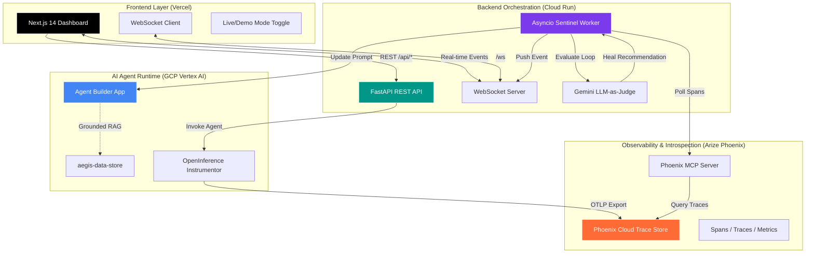

# ️ AEGIS: Autonomous AI Agent Guardian

> **Google Rapid AI Agent Hackathon | Arize Track Submission**

AEGIS Sentinel is a production-grade meta-agent system that autonomously monitors, detects loops in, and heals Google Cloud Vertex AI agents in real-time. Built for the Arize track, it demonstrates code-owned runtime instrumentation, Phoenix MCP self-introspection, and zero-downtime auto-healing via LLM-as-a-judge.

[](https://nextjs.org/)
[](https://fastapi.tiangolo.com/)
[](https://phoenix.arize.com/)
[](https://cloud.google.com/run)
[](https://vercel.com/)

---

## 💡 Inspiration

Agents get stuck in expensive loops. During e-commerce AI development, we watched agents call the same tool 50+ times on ambiguous queries, burning thousands of tokens before anyone noticed. Traditional observability shows damage *after* it's done. 

**AEGIS asks: What if an agent could watch other agents and heal them in real-time?**

---

## ✨ Key Accomplishments

-   **Meta-Agent Architecture:** First-of-its-kind system where one AI agent watches and heals others via MCP introspection
-   **Code-Owned Runtime Compliance:** Full OpenInference instrumentation of Vertex AI SDK (not just visual console)
-   **Real-Time Self-Healing:** Zero-downtime loop detection → LLM judgment → prompt rewrite → WebSocket notification
-   **Production Security:** Zero-trust frontend, GCP Secret Manager, CORS lockdown, masked API keys
-   **Premium UX:** Split-screen Config Playground showing live prompt rewrites with Framer Motion animations
-   **Serverless Deployment:** Cloud Run backend (scales to $0) + Vercel frontend with automated CI/CD

---

## 🏗️ System Architecture



### Architecture Components

| Component | Technology | Purpose |
|-----------|-----------|---------|
| **Frontend** | Next.js 14, TypeScript, Framer Motion | Premium SaaS dashboard with live mode toggle |
| **Backend API** | FastAPI, Pydantic, Uvicorn | REST endpoints + WebSocket server |
| **Sentinel Worker** | asyncio, httpx | Background loop detection polling (5s interval) |
| **LLM Judge** | Gemini 2.0 Flash | Evaluates trace severity & generates heal prompts |
| **Agent Runtime** | Vertex AI SDK, Discovery Engine | Code-owned agent invocation with OpenInference tracing |
| **Observability** | Arize Phoenix Cloud, MCP Server | Trace storage + runtime self-introspection |
| **Deployment** | GCP Cloud Run, Vercel, Secret Manager | Serverless backend + auto-deploying frontend |

---

##  Quick Start

### Prerequisites
- Python 3.11+
- Node.js 18+
- GCP Project with Vertex AI & Cloud Run enabled
- Arize Phoenix Cloud account

### Backend Setup

```bash
cd backend
python -m venv venv
source venv/bin/activate  # Windows: venv\Scripts\activate

pip install -r requirements.txt

# Create .env from example
cp .env.example .env
# Fill in: PHOENIX_API_KEY, GCP_PROJECT_ID, AGENT_ID, GEMINI_API_KEY
```

### Frontend Setup

```bash
cd frontend
npm install

# Create .env.local
echo "NEXT_PUBLIC_BACKEND_URL=http://localhost:8000" > .env.local

npm run dev
```

### Local Validation

```bash
# Terminal 1: Start Backend
cd backend && python -m main

# Terminal 2: Start Frontend  
cd frontend && npm run dev

# Terminal 3: Test Loop Detection (run 3x rapidly)
curl -X POST http://localhost:8000/api/chat \
  -H "Content-Type: application/json" \
  -d '{"message": "search for invisible apple"}'
```

---

## ☁️ Production Deployment

### Backend (Cloud Run)

```bash
# Store secrets securely
echo -n "$PHOENIX_API_KEY" | gcloud secrets create phoenix-api-key --data-file=-
gcloud secrets create gcp-sa-json --data-file=./backend/gcp-service-account.json

# Deploy with cost controls
gcloud run deploy aegis-backend \
  --source ./backend \
  --region us-central1 \
  --allow-unauthenticated \
  --set-env-vars PHOENIX_PROJECT=AEGIS,GCP_LOCATION=global \
  --set-secrets PHOENIX_API_KEY=phoenix-api-key:latest,GCP_SERVICE_ACCOUNT_JSON=gcp-sa-json:latest \
  --min-instances 0 --max-instances 1 \
  --cpu 1 --memory 512Mi --timeout 300s
```

### Frontend (Vercel)
1. Push to GitHub → Auto-deploys
2. Set env var: `NEXT_PUBLIC_BACKEND_URL=https://your-cloud-run-url.run.app`
3. Update backend CORS to include your Vercel domain

---

## 🔒 Security Practices

-   **Zero Secrets in Code:** All credentials via GCP Secret Manager or `.env`
-   **Zero-Trust Frontend:** Never calls GCP/Arize directly; proxies through backend
-   **CORS Lockdown:** Explicit origin allowlist for localhost + production
-   **Masked Responses:** API keys returned as `arize_****1234` to UI
-   **Git Hygiene:** Service account JSON excluded via `.gitignore`

---

##  Demo Walkthrough

1.  **Landing Page:** Clean, focused entry point
2.  **Dashboard Tabs:** Overview → Agents → Live Traces → Config Playground → Settings
3.  **Live Traces:** 7+ real-time spans color-coded by health status
4.  **GCP Agent:** Connected to `aegis-data-store` with grounded IT policy/product catalog
5.  **Phoenix Cloud:** Spans show exact tool call patterns; metrics flag anomalies
6.  **Auto-Heal:** Trigger loop → Watch prompt rewrite in Config Playground → See WS event
7.  **Cloud Run:** Serverless deployment with `--min-instances 0` cost control

---

## ️ Tech Stack

| Category | Technologies |
|----------|-------------|
| **Languages** | Python 3.11+, TypeScript |
| **Frontend** | Next.js 14, React 18, Tailwind CSS, shadcn/ui, Framer Motion, Zustand |
| **Backend** | FastAPI, Uvicorn, WebSockets, Pydantic, asyncio |
| **AI/ML** | Vertex AI SDK, Gemini 2.0 Flash, OpenInference, Phoenix MCP |
| **Cloud** | GCP Cloud Run, Vercel, GCP Secret Manager, Arize Phoenix Cloud |
| **Security** | CORS, Environment Variables, Masked Keys, Zero-Trust API |

---

## 🔮 What's Next

-   **Multi-Cloud Support:** OpenAI, Anthropic, LangChain, LlamaIndex agents
-   **Advanced Healing:** Dynamic tool parameters, fallback tools, context optimization
-   **Team Features:** RBAC, audit logs, IAM-based notifications
-   **Cost Analytics:** ROI dashboard showing savings from prevented loops

---

## 📜 License

MIT License - See [LICENSE](LICENSE) for details.

---

**AEGIS Sentinel** started as a solution to a painful problem but points to the future of AI infrastructure: **agents that manage themselves**. Built solo during a hackathon with AI-assisted development, strict manual review, and a "fail fast, fix faster" mentality.

> *"If I couldn't explain a module simply to myself at 3 AM, it needed refactoring."* — Abhishek Mishra ❤
```
